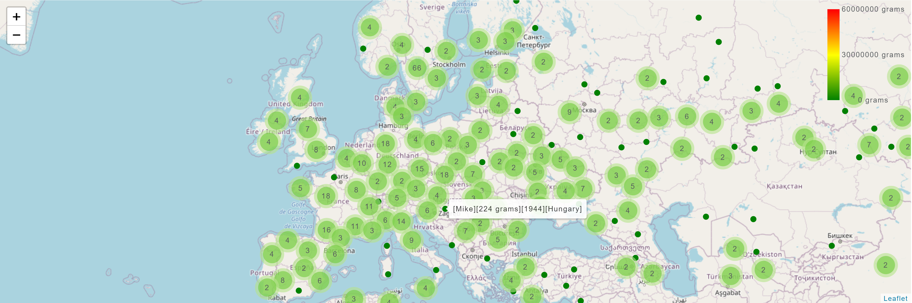
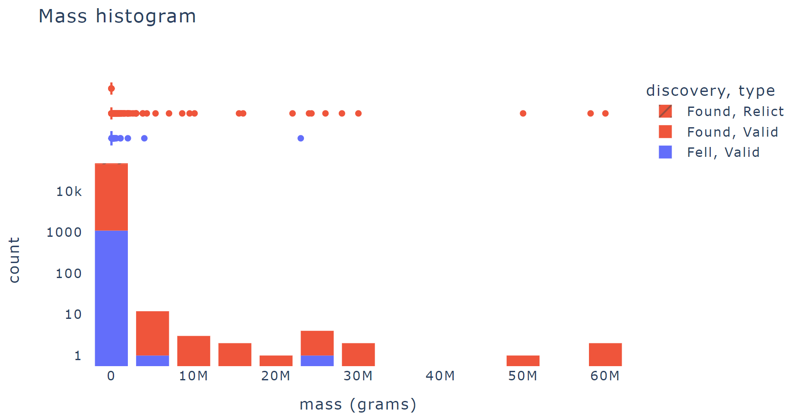
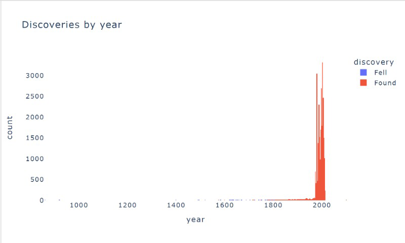
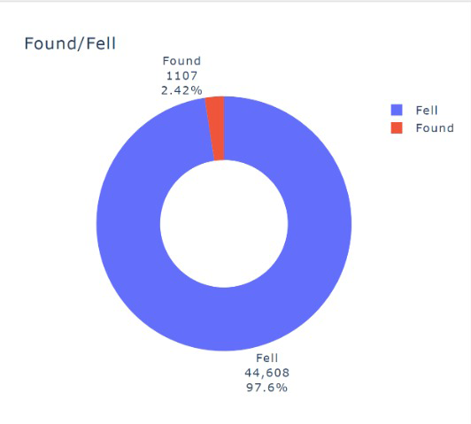
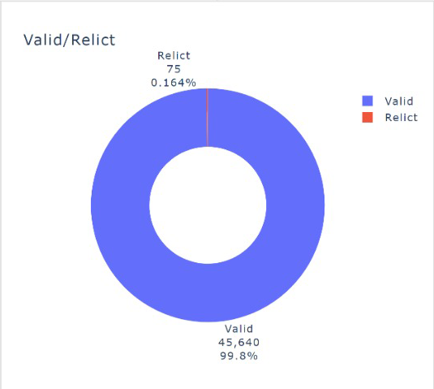
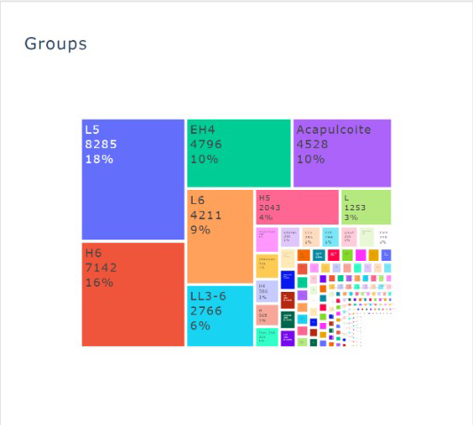

# COMP0034 Coursework 1 - Group 1 Repository

## Summary

This readme contains details about ImpactMap, a plotly app that uses a NASA dataset about meteorites to map and visualise geographical, contextual, and other scientific data in a series of plotly graphs and illustrations.

# 1 Technical Information

## 1.1 Repository URL

[comp0034-cw1-g-group-1-1](https://github.com/ucl-comp0035/comp0034-cw1-g-group-1-1/) created by B.T, L.L.P, V.G.G, W.S.

## 1.2 Dataset

Original: [Meteorite Landings](https://data.nasa.gov/Space-Science/Meteorite-Landings/gh4g-9sfh) by NASA (2018)

Prepared: [meteorite_data_with_countries.csv](appdata/meteorite_data_with_countries.csv)

# 2 Questions to be Answered

There were several questions that were posed to be answered by the work of this project through manipulation of the given dataset.
Although the answers are not explicitly stated, they can been seen through the different visualisations that have been created.

> How distributed are the meteorites that have been recorded? Is there any bias/pattern regarding geographical location?

> What is the trend in discovering the meteorites? Are they found on ground or seen falling more?

> What is the mass distribution of meteorites?

# 3 Similar Products

Similar products already do exist, however they often have hindrances due to one or a combination of factors such as non-user friendly interfaces,
hard-to-see colour schemes for those with colour blindness, required subscriptions or signups, and a deluge of information that makes it difficult
to navigate the webpage, and much more.

[Nasa Dashboard](https://data.nasa.gov/Space-Science/Meteorite-Landings/ak9y-cwf9) by NASA (2018)

[Dashboard Week Day 5 - Meteorites!](https://public.tableau.com/app/profile/nick.jastrzebski/viz/Meteoritesworkbook/Changeovertime) by Nick Jastrzebski

[Meteorites Landing](https://meteorite-lb.herokuapp.com/) by Loïc Bachelot

# 4 Target Audience

The target audience for the app consists of anyone with a basic knowledge and some level of interest in meteorites and
meteorite landings. This can range from anyone with a high school project related to meteorites to scientists in various
space agencies. Since the aim of the plotly app is to be as user-friendly as possible, with considerations for eye
strain taken for the colour scheme, to how the information will be arrayed from the simplest and easiest to understand graphs
at the beginning of the page, with the more complex and information-heavy graphs accessed as the user scrolls down.

The colour scheme, ease of usage, and the slight simplification of information also makes it a great educational tool
for young kids to introduce them to the concept of meteorites. Geologists will also be interested in the app as it displays information
related to the composition of a meteorite, which can be used to link to the mineral and metal deposits around the globe. The app also does away with
complexity as is seen in existing platforms that use similar databases, and on top of that will be free to use with no login required, as that is also another issue
postulated by current competitors.

An example persona has been included in the images folder. [Link](images/persona.png)

# 5 Visualisation Designs

## 5.1 Guiding Principles

To design the visualisations, a variety of literature was consulted for general guidelines that would make the visualisation
more palatable to the general audience while not losing the intended effect of the information shown. The primary focus
of the project in terms of data visualisation is to retain the meaning of the information, but in a way that does not instill a bias
in the viewer in part due to the designers, but rather that the information remains transparent and free of interpretation
from its creators. As such, the concepts listed below were used as an aid. Resources such as the Data Visualisation Catalogue (Ribecca, n.d.) were used
to determine the most suitable chart types to convey the relevant information.

**Data:ink ratio**

Introduced by Edward Tufte, data:ink ratio refers to the amount of ink used for conveying data directly divided by the total ink in a visualisation.
For example, In essence, the goal is to have a high data:ink ratio, where elements that don't add any new information to the visualisation are removed.
This could mean background shading, shadows, unnecessary outlines and tick marks, and redundant information. This is to improve focus on the
main aspect of the visualisation, which is the data that should be easy to see and interpret (Figueroa, 2019).

**Chartjunk**

The term 'chartjunk' simply refers to visual aspects of an infographic that serve no purpose in conveying knowledge. To avoid this,
Edward Tufte recommends foregoing detailing that could make an infographic look cluttered and distract the viewer. Although, the debate continues
as to what embellishments are necessary, since the data from the research should speak for itself, but research finds that audiences are better able to remember
charts with embellishments than those with none. However, a rule of thumb here is 'when in doubt, leave out' (Enago Academy, 2018).

**Five Qualities of Great Visualizations**

A holistic concept by Alberto Cairo, there are five qualities of great chart design, which aren't necessarily independent of one another
and can often be related or interact with one another (Figueroa, 2019). The five qualities as mentioned by Cairo are: truthful,
functional, beautiful, insightful, and enlightening.

> The 'truthful' quality relates to how subjectivity can be divorced from data analytics. Each modification to the raw set of
> data must be thought of carefully, with any possible obscurity of data pinpointed, with pattern hunting not being the focus
> of the visualisation. Secondly, the obligation to the audience of presenting the data in a truthful manner must be remembered,
> with industry-accepted techniques being used for designing and portraying the data, with audience's reading level kept in mind (Figueroa, 2019).

> The 'functional' aspect focus on the usefulness and practicality of the visualisation, with techniques such as data:ink ratio being used
> to increase it (Figueroa, 2019).

> A visualisation must also be 'beautiful', where once again the tastes of the audience are kept in consideration. This can be influenced
> by a softer colour scheme and data:ink ratio principles (Figueroa, 2019).

> The 'insightfulness' of a visualisation stems from the fact that it does not just merely replicate raw data. It uncovers trends or relationships, with the results of the study being
> absorbed quickly by the reader (Figueroa, 2019).

> The final quality, 'enlightening', is an amalgamation of the previous four, where all have been successfully mixed to provide a valuable revelation (Figueroa, 2019).

**Misleading Visuals**

A topic written in some detail by Alberto Cairo (2014), where he contemplates the challenges and drawbacks of evidence-driven visual communication, such as how visualisations can be used as a form of propaganda to decieve an audience. According to Cairo, most graphical deceptions are based on three strategies:

> 1. Hiding relevant data to focus on what is beneficial for the author's purposes.

> 2. Obscuring reality by presenting too much data at once.

> 3. Distorting the data by using graphic design in inappropriate ways.

Cairo then lists some skills and principles which would be useful in his opinion to combat this phenomenon, such as the
awareness of cognitive biases within oneself or other members of the team, lessons on the interpretation of scientific data and claims,
knowledge of statistics in a conceptual sense and information about how designs of infographics are perceived visually and cognitively.

Although the team cannot claim to have satisfied these criteria in the fullest manner, being aware of these guidelines certainly aided
in design choices for the infographics for this coursework.

**Design for Colour Blindness**

Since colour blindness affects a significant portion of the population, the design of visualisations had to take into consideration the colours that were used,
as well as how contrast was displayed. By using the 'Cyborg' theme, certain colour combinations such as red/green, green/brown, blue/purple and more were avoided
as the chosen theme mainly displays graphs in blue or orange, which was consistent for all except one visualisation, which required a large number of colours to display
properly (Collinge, 2017).

**Child-friendly Colours**

In tandem with the colour-blind friendly colour scheme, the selected colours through the 'Cyborg' theme were chosen due to their vibrance.
Since the theme primarily uses blue and orange, it was suitable since a part of the target audience is meant to be children as they are attracted to 
these colours in vibrant tones (deBara, 2018). 

## 5.2 List of Visualisations

### 5.2.1 World Map with Meteorite Landings

The target audience for this visualisation is the general target audience of the Impact Map plotly app, from young school-going kids to adults with some curiosity about where meteorites have fallen on Earth. As such the map is quite simple in its display of information, and answers the question: how and where are intact meteorites found on the earth?

The data required for this visualisation for each meteorite was its latitude and longitude of impact and if it was first spotted falling, or after it had already impacted. The size of the meteorite was also necessary for the sizing of the bubbles on the map. The type of visualisation used was a general world map in Mercator projection, with bubbles denoting the meteorites' locations.

As for the design choices, the blue and orange colour scheme satisfies our condition for being friendly to colour blindness, and the simplicity of the map with no added and unnecessary features conforms to the principles of chartjunk and data:ink ratio. It also has some great qualities pertaining to insightfulness as some results may not be expected, as most would have expected an even spread of meteorites or a correlation with population (which would have made them likelier to be found or spotted).

As for the weaknesses of the map, it could be improved by being able to zoom into the map to see the locations up close, or by being able to hover over a bubble and have a pop-up with more information about the meteorite.

### 5.2.2 Mass Histogram

The target audience for this visualisation is the general target audience of the app, but requires some interest in the mass spread of meteorites to have fallen, and as such is the same target audience as the one for the map. The visualisation answers the question: What are the sizes of meteorites that fall?

The data required for this visualisation was the mass of each meteor in kilograms, as well as if they were discovered falling or had already impacted, with the type of visualisation used being a stacked bar chart.

For the design choices, the blue and orange colour scheme satisfies colour blind-friendly design principles, and chartjunk and data:ink ratio principles are adhered to as well due to the simplicity of the visualisation. The graph itself is complementary to the map, but makes it easier to visualise the amount of meteorites by their mass groupings.

As for any improvements, there could be a potential feature that highlights a selected stack of meteorites from the histogram on the map, which would be useful to see where the especially large meteorites were discovered. 

### 5.2.3 Discoveries by Year

For this visualisation, the target audience remains the same as that of the general app. It builds on the previous information shown in the world map of meteorites, with the assumption that the viewers interested in that information will also find it interesting to learn when meteorites were discovered on a more general scale.

The data used for this visualisation was the year of discovery of each meteorite and whether it was discovered already impacted or falling from the sky, and the question answered here is 'when did meteorite discoveries take place?'

For the design choices, the colour scheme adheres to colour-blind design principles as the previous visualisations (although one colour dominates), and data:ink ratio and chartjunk concepts are also considered. The graph used was a stacked bar graph, as it was deemed the best to showcase the significant increase in discoveries beginning in the 20th century.

As for any design improvements, the chart could have pointed out either when the 'fell' ones were discovered as they are a very insignificant minority. Additionally, there could have been some information on the graph as to what correlated with the jump in discoveries, such as satellite technology or better cartographic practices for example. 

### 5.2.4 Found/Fell Proportion

For this visualisation, the target audience was similar to ones for the other visualisations, however the information is more simple in that only the percentages of 'fell' and 'found' are shown.

The data used was also just the 'fell' and 'found' characteristics for each meteorite, and is used to answer: what is the percentage of meteorites that are found on the ground compared to first observed falling from the sky?

For the design choices, blue and orange are used for the same reasons as the other visualisations for colour blind-friendly and child-friendly design, with a donut chart used to display the information to break the monotony of stacked bar charts and provide diversity. The simplicity of the chart also conforms to principles of data:ink ratio and chartjunk.

### 5.2.5 Valid/Relict Proportion

For this graph, the target audience remains the same as the other visualisations, and is a complement to all the other information from the previous visualisations. Valid in this case means that the there is consensus that this was a whole meteorite which has not been significantly altered over time, whereas relict says otherwise. 

The data used for this chart was just the valid/relict labels for each meteorite, and a donut chart was used to simplify the display of information. It answers the question: which percentage of meteorites are found relict vs valid?

For the design choices, the same reasoning is applied to this visualisation as the previous ones, with the colour scheme and the conforming to data:ink ratio and chartjunk concepts. 

### 5.2.6 Grouping of Meteorites

The target audience for this visualisation diverges from the one for the other graphs, as there is quite a lot of information on it. Meteorites are grouped according to their composition, and markers such as 'L5' are assigned to these meteorites as naming conventions. For example, 'L6' denotes meteorites with relatively low iron compared to others, and are mainly composed of minerals such as olivine and hypersthene. Due to this abundance of information, this chart is intended for this with interest or wide knowledge in 
geology or meteorite compositions as part of their field.

The data used here were the markers for each meteorite for their composition label, and then used to make a tree map type chart to answer the question: what are the types of meteorites found on earth by their composition?

For the design choices, the colour scheme had to be expanded as to display all the information necessary which breaks colour blind-friendly design principles, but still retains data:ink ratio and chartjunk ideals. 

However, there could have been alternate ways to display this information, but they would have required much more space on the app's page. The coloured boxes themselves could have had some form of shading or texture to make them easier to discern, but that may have increased chartjunk.

# References

Cairo, Alberto. (2014). *Chapter 5: Graphics Lies , Misleading Visuals: Reflections on the Challenges and Pitfalls of Evidence-Driven Visual Communication*.

Collinge, Robyn. (2017). *How to Design for Color Blindness*. Retrieved from: https://www.getfeedback.com/resources/ux/how-to-design-for-color-blindness/

deBara, Deanna. (2018). *Designing for kids: 3 ways to make children love your product*. Retrieved from: https://99designs.co.uk/blog/logo-branding/designing-for-kids/

Enago Academy. (2018). *Chartjunk: How to Avoid Confusing Elements in Your Figures*. Retrieved from: https://www.enago.com/academy/chartjunk-how-to-avoid-confusing-elements-in-your-figures/

Figueroa, Anthony. (2019). *Data Visualisation and the Truthful Art*. Retrieved from: https://www.rootstrap.com/blog/data-visualization-and-truthful-art/

National Aeronautics and Space Administration. (2018). *Meteorite Landings* Retrieved from: https://data.nasa.gov/Space-Science/Meteorite-Landings/gh4g-9sfh

Ribecca, Severino. (n.d.) *The Data Visualisation Catalogue*. Retrieved from: https://datavizcatalogue.com/about.html

# Weekly Status Reports

## Week 1

>For this first week, our group of 4 came together to discuss the coursework specifications and which of the 4 datasets we should create the app for. We decided to tackle the Meteorite landing dataset, due to its high potential for interesting visuals; and consequently started thinking about how to best represent each dataset field.

>Next week we plan to meet again to discuss the HTML component taught in the week's material, and begin working together on the dashboard.

>No issues impending progress

## Week 2
 
>This week we met for the lab session to test our understanding on the html and css principles given for this week. We divided work to progress with the repository and started looking into Plotly Dash.

>Next week we plan to learn more about Plotly Dash and be able to start adding relevant code for our coursework project.

>No issues impending progress

## Week 3

>This week we discussed further Plotly functions such as Go, and started designing each of the required graphs.

>Next week we plan to continue with the graphs and start testing before the teaching materials to save time, as well as begin writing the README.md file.

>No issues impending progress.

## Week 4

>This week we went through the new material and kept working on the app, dividing it into separate code files to improve teamwork. We also started testing before next week to help ease the time constraints after the labs.

>Next week we plan to continue with testing with help from the teaching team and start adding the graphs required to the layout.

>No issues impending progress.

## Week 5

>This week we solved some issues with testing and focussed on adding interactivity and formatting to our app, as well as continuing with adding graphs, polishing and reporting our progress in the README file.

>Next week we plan to fully complete the dashboard to submit and start thinking about what features we should add to our flask app.

>No issues impending progress.